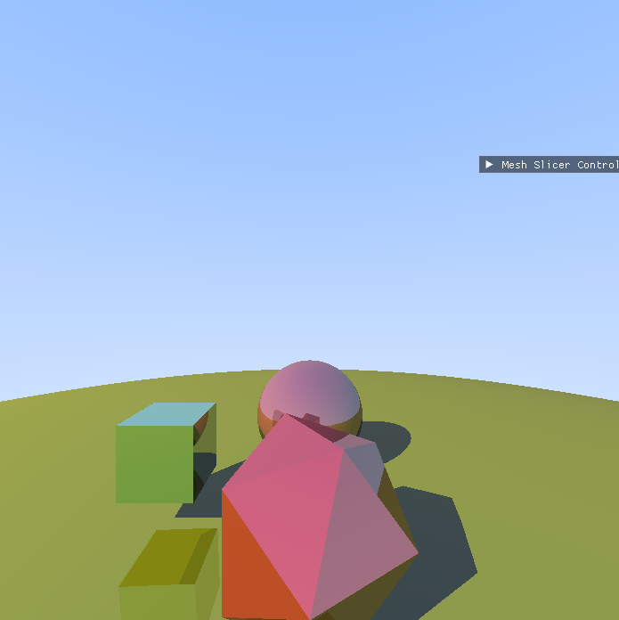
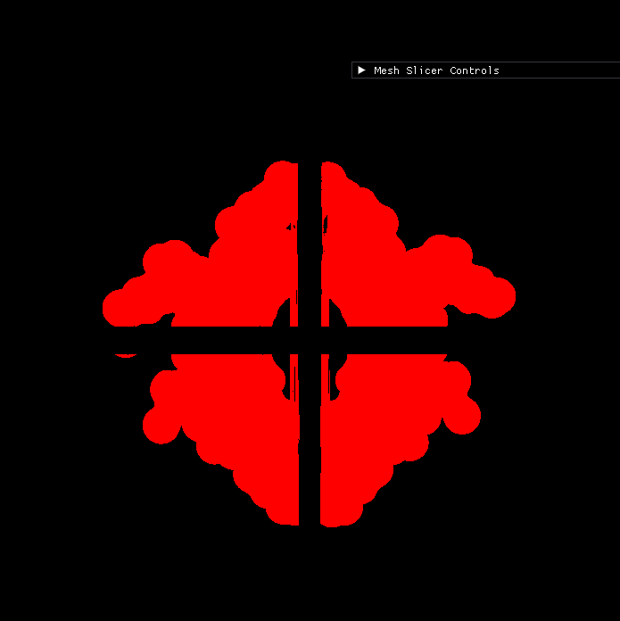

# 3D Graphics Sandbox

This project is an interactive 3D graphics application developed in C++ using OpenGL. It demonstrates several advanced computer graphics algorithms, including 3D model rendering, ray tracing, mesh slicing, and 2D primitive drawing. The application features a comprehensive user interface built with ImGui, allowing for real-time manipulation of scene objects and algorithm parameters.

## Features

*   **3D Model Rendering**: Load and render 3D models from Object File Format (`.off`) files.
*   **Ray Tracing Mode**: A secondary rendering mode that demonstrates ray tracing with basic geometric primitives like spheres and cubes, including reflections and lighting.Along with user controlled parameters like lights position,object's reflectivity and color.
    
*   **Interactive Mesh Slicing**: Dynamically slice rendered meshes using one or more user-defined planes. The application generates capping geometry to close the resulting holes.
    
*   **2D Drawing Algorithms**:
    *   Draw 2D lines using Bresenham's line algorithm.
    *   Define custom polygons and fill them using the Scan-line polygon fill algorithm.
*   **Interactive GUI**: A robust control panel built with Dear ImGui allows for easy switching between modes and adjusting parameters for lighting, object properties, slicing planes, and more.

## Algorithms Implemented

This project implements several fundamental and advanced computer graphics algorithms:

*   **[Bresenham's Line Algorithm](https://en.wikipedia.org/wiki/Bresenham%27s_line_algorithm)**: Used for drawing 2D lines. It is an efficient algorithm that uses only integer addition, subtraction, and bit shifting to determine which pixels to fill. This is implemented in `drawLine2DBresenham` in [`assign_3_final2/src/graphics_utils.cpp`](assign_3_final2/src/graphics_utils.cpp).

*   **[Scan-line Polygon Fill Algorithm](https://en.wikipedia.org/wiki/Scanline_rendering)**: Used for filling custom-drawn polygons. The algorithm works by iterating through scan-lines (horizontal lines) and filling the pixels between pairs of intersection points with the polygon's edges. The implementation uses an edge table and an active edge table to manage intersections efficiently. This is controlled from the `RenderImGui` function in [`assign_3_final2/src/main.cpp`](assign_3_final2/src/main.cpp).

*   **[Ray Tracing](https://en.wikipedia.org/wiki/Ray_tracing_(graphics))**: A rendering technique for generating an image by tracing the path of light as pixels in an image plane and simulating its effects with virtual objects,handling multiple reflections.The implementation includes ray-sphere,ray-cube,ray-plane and ray-mesh intersection tests to render simple geometric scenes with realistic lighting and reflections.

*   **Mesh Slicing**: This technique cuts a 3D mesh with a mathematical plane. Vertices on one side of the plane are discarded, and new vertices are generated along the intersection line. These new vertices are then triangulated to create a "cap" that seals the cut mesh. The core logic is in the `sliceMesh` function in [`assign_3_final2/src/mesh.cpp`](assign_3_final2/src/mesh.cpp).

## How to Build and Run

### Prerequisites

*   A C++ compiler (like GCC or Clang)
*   `make`
*   OpenGL libraries
*   GLEW
*   GLFW

### Building

1.  Navigate to the project's `assign_3_final2` directory.
    ```sh
    cd assign_3_final2
    ```
2.  Run the `make` command to compile the source code. This will use the provided [`Makefile`](assign_3_final2/Makefile).
    ```sh
    make
    ```
    This will generate an executable file named `sample`.

### Running

1.  After a successful build, run the application from within the `assign_3_final2` directory:
    ```sh
    ./sample
    ```
2.  The application window will open, displaying the default 3D model and the ImGui control panel. Use the panel to explore the various features.

### Cleaning Up

To remove the compiled object files and the executable, run:
```sh
make clean
```

## License

MIT License

Copyright (c) 2025 Virat Garg

Permission is hereby granted, free of charge, to any person obtaining a copy
of this software and associated documentation files (the "Software"), to deal
in the Software without restriction, including without limitation the rights
to use, copy, modify, merge, publish, distribute, sublicense, and/or sell
copies of the Software, and to permit persons to whom the Software is
furnished to do so, subject to the following conditions:

The above copyright notice and this permission notice shall be included in all
copies or substantial portions of the Software.

THE SOFTWARE IS PROVIDED "AS IS", WITHOUT WARRANTY OF ANY KIND, EXPRESS OR
IMPLIED, INCLUDING BUT NOT LIMITED TO THE WARRANTIES OF MERCHANTABILITY,
FITNESS FOR A PARTICULAR PURPOSE AND NONINFRINGEMENT. IN NO EVENT SHALL THE
AUTHORS OR COPYRIGHT HOLDERS BE LIABLE FOR ANY CLAIM, DAMAGES OR OTHER
LIABILITY, WHETHER IN AN ACTION OF CONTRACT, TORT OR OTHERWISE, ARISING FROM,
OUT OF OR IN CONNECTION WITH THE SOFTWARE OR THE USE OR OTHER DEALINGS IN THE
SOFTWARE.